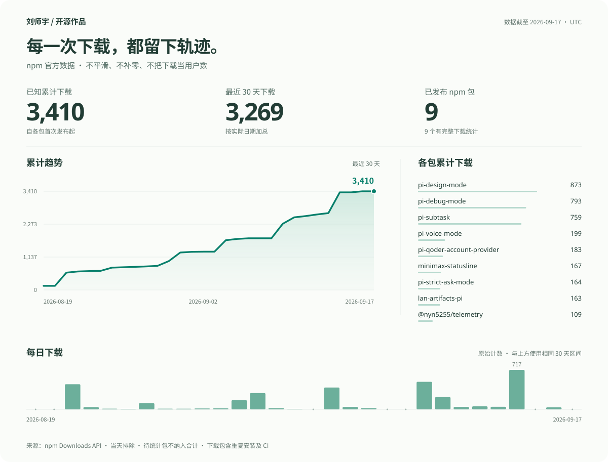

```text
npm API -> verified daily data -> download chart
```
# 刘师宇

构建实用的 Pi 扩展、编程 Agent 工具与本地优先的自动化流程。

## npm 下载曲线

[](./data/npm-downloads.json)

每日从 npm 官方 Downloads API 更新，截止 **UTC 昨天**，不纳入当天的不完整数据。
- 主曲线展示已知累计下载在最近 30 天内的变化，下方是同区间的真实每日计数，不做平滑。
- 累计值从各包首次发布起计算；最近 30 天严格包含截止日在内的 30 个日期，不等同于 npm 的 `last-month` 相对区间。
- `N/A` / 待统计表示数据未提供或不完整，不当作零；不完整包不纳入已知合计。
- 从两个 npm 账号自动发现包，并核对 GitHub repository 归属；下载包含重复安装与 CI，不是独立用户数。

## Public npm packages

| Package | npm account | Purpose |
| --- | --- | --- |
| [`pi-subtask`](https://www.npmjs.com/package/pi-subtask) | `liushiyumathxjtu` | Pi subagent orchestration |
| [`pi-voice-mode`](https://www.npmjs.com/package/pi-voice-mode) | `liushiyumathxjtu` | Voice workflow for Pi |
| [`@liushiyumathxjtu/minimax-statusline`](https://www.npmjs.com/package/@liushiyumathxjtu/minimax-statusline) | `liushiyumathxjtu` | MiniMax status line |
| [`pi-strict-ask-mode`](https://www.npmjs.com/package/pi-strict-ask-mode) | `liushiyumathxjtu` | Strict clarification mode for Pi |
| [`lan-artifacts-pi`](https://www.npmjs.com/package/lan-artifacts-pi) | `liushiyumathxjtu` | LAN artifact delivery for Pi |
| [`pi-qoder-account-provider`](https://www.npmjs.com/package/pi-qoder-account-provider) | `nyn5255` | Qoder account provider for Pi |
| [`pi-debug-mode`](https://www.npmjs.com/package/pi-debug-mode) | `nyn5255` | Evidence-first debugging workflow for Pi |
| [`pi-design-mode`](https://www.npmjs.com/package/pi-design-mode) | `nyn5255` | Brief-first design exploration for Pi |

Source data remains available in [`data/npm-downloads.json`](./data/npm-downloads.json).
